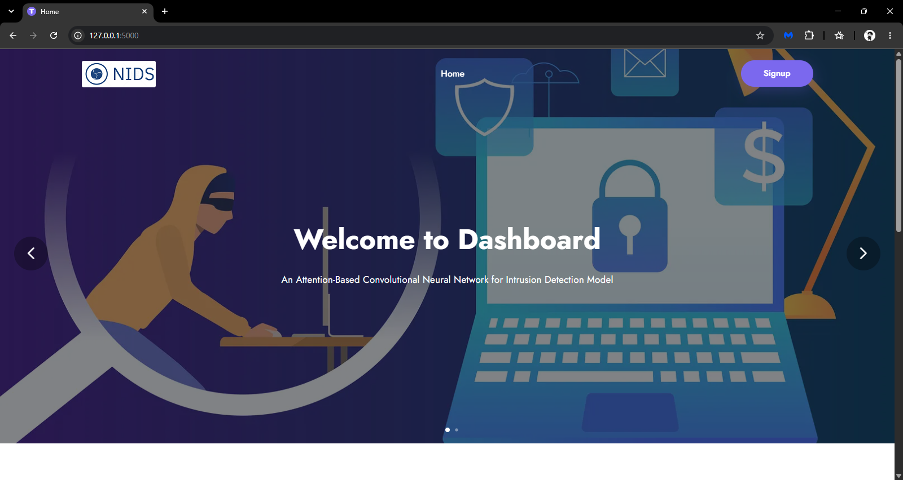
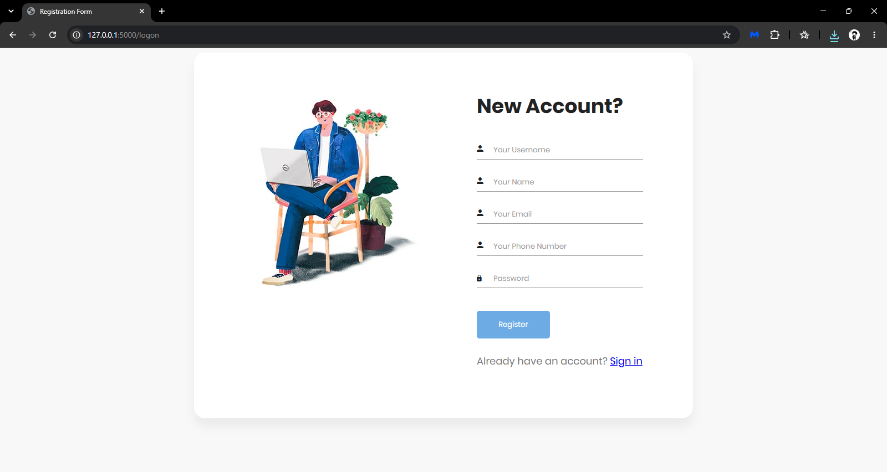
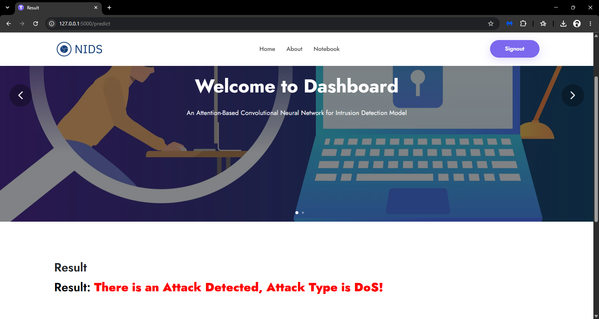

# Network Intrusion Detection System (NIDS)

A deep learning based Network Intrusion Detection System with a Flask web
interface for user authentication and real-time traffic classification.




## Overview

This project classifies network flow data as benign or malicious, comparing
four deep learning architectures trained on the **CSE-CIC-IDS2018** dataset.
Ten flow-level features (packet length statistics, inter-arrival times,
segment sizes, etc.) are extracted per connection and fed into each model
for binary classification.

## Models Compared

| Model                | Accuracy | Precision | Recall | F1-Score |
|-----------------------|----------|-----------|--------|----------|
| CNN                   | 0.971    | 0.972     | 0.971  | 0.971    |
| Deep Neural Network   | 0.993    | 0.993     | 0.993  | 0.993    |
| BiLSTM                | 0.996    | 0.996     | 0.996  | 0.996    |
| CNN + LSTM            | 1.000    | 0.972     | 0.972  | 0.972    |

## Architecture

- **Feature set:** 10 selected flow features (Fwd/Bwd packet length stats,
  Flow IAT Std, Packet Size Avg, Subflow Fwd Bytes, etc.)
- **Models trained:** Dense Neural Network, BiLSTM, CNN, and a combined
  CNN+LSTM architecture, each evaluated on accuracy, precision, recall, and F1
- **Web interface:** Flask, with SQLite-backed user authentication
  (signup/login with OTP verification)

## Tech Stack

Python · TensorFlow / Keras · Scikit-learn · Pandas · Flask · SQLite

## Getting Started

```bash
git clone https://github.com/Drakendvk28/Intrusion-Detection-CNN-LSTM.git
cd Intrusion-Detection-CNN-LSTM/code_folder/Extension

# activate your virtual environment
tfenv\Scripts\activate      # Windows

pip install -r requirements.txt
python app.py
```

Then open `http://127.0.0.1:5000` in your browser.

## Dataset

- [CSE-CIC-IDS2018](https://www.unb.ca/cic/datasets/ids-2018.html)

## Author

**Dakara Venkata Kishore Aditya**
[LinkedIn](https://www.linkedin.com/in/dvk-venkat/) · [GitHub](https://github.com/Drakendvk28)
